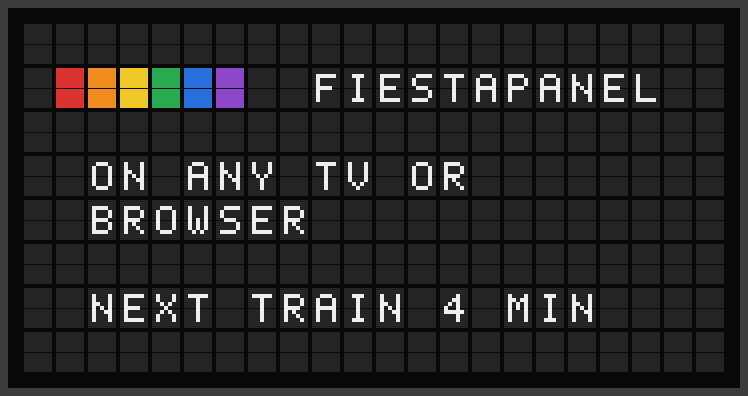

# FiestaPanel Plugin

Show your FiestaBoard pages full-screen on any TV or browser, as a board FiestaBoard draws itself.



**→ [Setup Guide](./docs/SETUP.md)**

## Overview

The FiestaPanel plugin is an output plugin with no hardware behind it. FiestaBoard keeps each frame it renders for the board, and the panel's viewer — the FiestaBoard TV app or a browser — fetches it from `GET /panel/{id}/frame` and draws it, as split flaps or as an LED matrix. The plugin decides which frames fit the board; FiestaBoard does everything else.

## Template Variables

An output plugin exposes no template variables. Every page and template renders on a panel; the panel's grid, sized from the screen, decides how much fits.

## Example Templates

A clock line on a panel:

```jinja
{center}{violet} GOOD MORNING {violet}
{center}{{date_time.time}}
```

## Configuration

A FiestaPanel has no connection to configure. Its shape belongs to the board:

| Setting | Type | Description |
|---------|------|-------------|
| `device_type` | `flagship` \| `note` \| `note_array` \| `panel` | The board's shape. A panel created from a TV is `panel`. |
| `grid_rows` / `grid_cols` | integer | A `panel`'s grid, 3–96 rows by 15–128 columns. |
| `notes_wide` / `notes_tall` | integer | A `note_array`-shaped panel's size in Notes. |

## Features

- Pull delivery: nothing is pushed to a device; the viewer fetches the last frame
- A frame of the wrong shape (after the panel was re-fit to a new screen) is never served
- Two looks from one board: split-flap and LED matrix (`fiestapanel_split_flap`, `fiestapanel_led_matrix`)
- No send floor and no connection to fail

## Author

FiestaBoard
